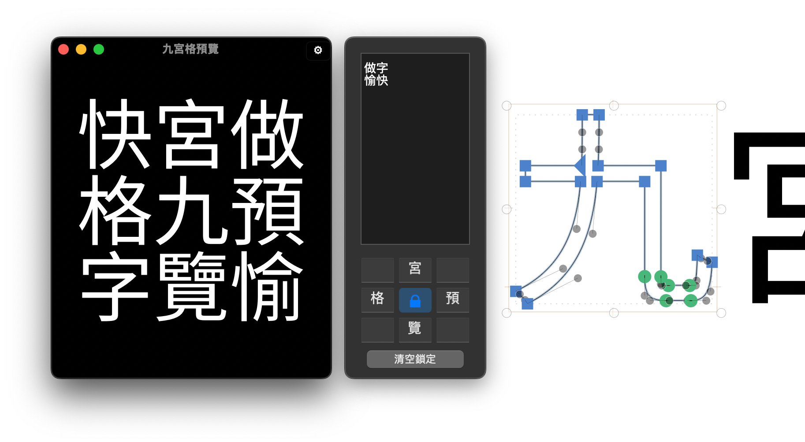

# 九宮格預覽 | Nine Box Preview

[繁體中文](#繁體中文) | [English](#english)

---

## 繁體中文

這是一個為 [Glyphs 字型編輯軟體](http://glyphsapp.com/) 開發的外掛，專為方塊字製作提供即時預覽功能。考量到漢字（東亞方塊字）的造型需要同時兼顧直排與橫排排版，這個工具讓你不用不斷切換預覽方式，可以一次看到各種排列組合。

### 主要功能

- 即時顯示正在編輯的字符
- 支援自訂周圍參考字符
- 提供明亮／黑暗兩種顯示模式
- 支援縮放功能，方便觀察細節
- 多國語言支援

### 安裝方式

1. 從「視窗」選單開啟「外掛程式管理員」。
2. 找到「九宮格預覽」並點擊「安裝」按鈕。
3. 重新啟動 Glyphs 即可使用。

🌿 注意：「九宮格預覽」需要 *Vanilla* 模組才能運作。請在「外掛程式管理員」的「模組」分頁中安裝 Vanilla。

### 系統需求

此外掛在 Glyphs 3.2.3 版本中測試通過。字符選擇器功能需要 Glyphs 3.2 或更高版本。

### 新功能與改進

相較於第一版，這次的更新解決了許多問題並新增了實用功能：

- 支援縮放功能，方便觀察字符細節
- 改善了字符對齊方式，支援不等寬字型
- 新增字符選擇器，方便快速選擇參考字符（需要 Glyphs 3.2 或更高版本）
- 優化了介面佈局，自適應視窗大小變化
- 增加了多國語言支援
- 改善了效能和穩定性

### 回饋與建議

如果你在使用過程中發現任何問題或有改進建議，歡迎透過 [GitHub Issues](https://github.com/yintzuyuan/NineBoxView/issues) 回報。我會盡快回應並處理。

### 致謝

特別感謝 Aaron Bell 的 [RotateView](https://github.com/aaronbell/RotateView) 外掛，讓我了解如何即時顯示正在編輯的字符。也要感謝大曲都市的 [Waterfall](https://github.com/Tosche/Waterfall) 外掛，啟發了我如何處理文字輸入和切換預覽顏色。

這次的改版要特別感謝 AI 輔助工具，它幫助我解決了許多技術難題，並提供了寶貴的改進建議。

最後，感謝所有使用這個外掛並提供回饋的設計師們。你們的意見是推動這個工具不斷進步的動力。

### 版權聲明

此外掛由殷慈遠於 2023 年 1 月首次發布，並於 2024 年 8 月進行重大更新。本專案採用 Apache License 2.0 授權。詳細授權條款請參閱專案中的 LICENSE 文件。

---

## English

This is a plugin developed for [Glyphs font editing software](http://glyphsapp.com/), specifically designed to provide real-time previews for the creation of square characters. Considering that the design of Chinese characters (East Asian square characters) needs to accommodate both vertical and horizontal layouts, this tool allows you to see various combinations at once without constantly switching preview modes.

### How to Use

1. Open the "Nine Box Preview" plugin from the "Window" menu.
2. The preview screen will display the character currently being edited in the center.
3. Use the input box at the bottom to modify the reference characters displayed around the center.
4. Click the button in the lower left corner to switch between Light/Dark display modes.
5. Use the mouse wheel or touchpad gestures to zoom in and out of the preview.
6. Double-click the preview area to reset the zoom level.
7. Use the Glyph Picker button to quickly select reference characters.

### Installation

1. Open the "Plugin Manager" from the "Window" menu.
2. Find "Nine Box Preview" and click the "Install" button.
3. Restart Glyphs to use the plugin.

🌿 Note: "Nine Box Preview" requires the *Vanilla* module to function. Please install Vanilla in the "Modules" tab of the "Plugin Manager".

### System Requirements

This plugin has been tested on Glyphs 3.2.3. The Glyph Picker feature requires Glyphs 3.2 or higher.

### New Features and Improvements

Compared to the first version, this update has resolved many issues and added useful features:

- Zoom functionality for detailed character observation
- Improved character alignment, supporting variable-width fonts
- Added a Glyph Picker for quick selection of reference characters (requires Glyphs 3.2 or higher)
- Optimized interface layout, adapting to window size changes
- Added multi-language support
- Improved performance and stability

### Feedback and Suggestions

If you encounter any issues or have suggestions for improvement while using the plugin, please report them via [GitHub Issues](https://github.com/yintzuyuan/NineBoxView/issues). I will respond and address them as soon as possible.

### Acknowledgements

Special thanks to Aaron Bell's [RotateView](https://github.com/aaronbell/RotateView) plugin, which helped me understand how to display the character being edited in real-time. Also, thanks to Toshi Omagari's [Waterfall](https://github.com/Tosche/Waterfall) plugin, which inspired me on how to handle text input and switch preview colors.

For this update, I'd like to particularly thank AI-assisted tools, which helped me solve many technical challenges and provided valuable improvement suggestions.

Lastly, thanks to all the designers who use this plugin and provide feedback. Your opinions are the driving force behind the continuous improvement of this tool.

### Copyright Notice

This plugin was first released by Tzuyuan Yin in January 2023 and underwent a major update in August 2024. This project is licensed under the Apache License 2.0. For detailed license terms, please refer to the LICENSE file in the project.